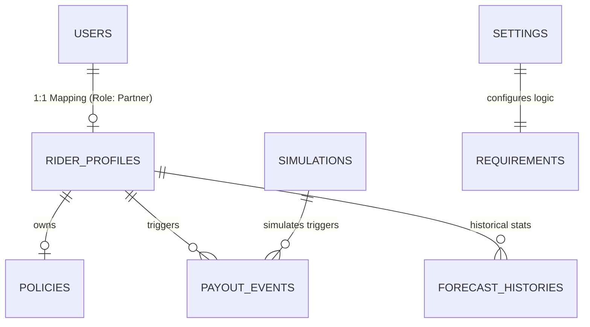

# SkySure Firestore Database Schema

This document provides a comprehensive map of the 10 Firestore collections used in the SkySure project. This serves as the source of truth for all ML training and backend routing logic.

## 1. Connectivity Map (ERD)

---

## 2. Collection Details & Sample Data (Top 5)

### A. `rider_profiles` (Primary Collection)
Contains the master records for all 1,000 riders.

| Attribute | Type | Description |
| :--- | :--- | :--- |
| `rider_id` | String | Unique Identifier (e.g., `TN_RID_1001`) |
| `name` | String | Partner's Display Name |
| `city` | String | Operating City |
| `trust_score` | Number | Normalized trust value (0-100) |
| `fraud_probability`| Number | ML-derived risk score (0.0-1.0) |
| `weekly_premium` | Number | Active premium requirement |
| `payout_history` | Array | Embedded list of settlement objects |

**Top 5 Sample Records:**
1. `TN_RID_1000`: { name: "Deepak Iyer", city: "Trichy", trust_score: 3, fraud_probability: 0.19 }
2. `TN_RID_1001`: { name: "Rahul Iyer", city: "Trichy", trust_score: 95, fraud_probability: 0.05 }
3. `TN_RID_1002`: { name: "Sonal Nair", city: "Madurai", trust_score: 11, fraud_probability: 0.81 }
4. `TN_RID_1003`: { name: "Anita Nair", city: "Madurai", trust_score: 8, fraud_probability: 0.92 }
5. `TN_RID_1004`: { name: "Vikram Sharma", city: "Chennai", trust_score: 72, fraud_probability: 0.12 }

---

### B. `payout_events` (Live Audit Log)
Immutable record of all parametric payout triggers.

| Attribute | Type | Description |
| :--- | :--- | :--- |
| `event_id` | String | Unique Transaction ID |
| `rider_id` | String | Reference to Rider |
| `payout_amount` | Number | Value disbursed in ₹ |
| `fraud_status` | String | `CLEAN`, `SUSPICIOUS`, or `FLAGGED` |
| `weather_at_trigger`| String | Environmental condition |

**Top 5 Sample Records:**
1. `00e840a9...`: { rider_id: "TN_RID_1037", payout_amount: 448, fraud_status: "CLEAN", weather: "Rainy" }
2. `01b2a3c4...`: { rider_id: "TN_RID_1582", payout_amount: 502, fraud_status: "CLEAN", weather: "Stormy" }
3. `02c3d4e5...`: { rider_id: "TN_RID_1991", payout_amount: 389, fraud_status: "SUSPICIOUS", weather: "Cyclone" }
4. `03d4e5f6...`: { rider_id: "TN_RID_1120", payout_amount: 610, fraud_status: "CLEAN", weather: "Heavy Rain" }
5. `04e5f6g7...`: { rider_id: "TN_RID_1405", payout_amount: 420, fraud_status: "CLEAN", weather: "Rainy" }

---

### C. `users` (Identity & RBAC)
Authentication and role management.

| Attribute | Type | Description |
| :--- | :--- | :--- |
| `uid` | String | Firebase Auth UID |
| `email` | String | Login Email |
| `role` | String | `admin` or `rider` |

**Top 5 Sample Records:**
1. `admin_demo_001`: { email: "admin@skysure.com", role: "admin" }
2. `usr_004d6056`: { email: "rider_usr_004d6056@example.com", role: "rider" }
3. `usr_00744bc6`: { email: "rider_usr_00744bc6@example.com", role: "rider" }
4. `usr_0084e60d`: { email: "rider_usr_0084e60d@example.com", role: "rider" }
5. `usr_00994ea8`: { email: "rider_usr_00994ea8@example.com", role: "rider" }

---

### D. `policies` (Financial Meta)
Insurance coverage details.

| Attribute | Type | Description |
| :--- | :--- | :--- |
| `policy_id` | String | PK (e.g., `POL-TN-2026-X`) |
| `plan_selected`| String | `basic`, `standard`, or `pro` |
| `total_paid` | Number | Aggregate premiums paid |

**Top 5 Sample Records:**
1. `POL-TN-2026-000000`: { plan: "pro", total_paid: 287.28, rider_id: "TN_RID_1000" }
2. `POL-TN-2026-000001`: { plan: "basic", total_paid: 120.50, rider_id: "TN_RID_1001" }
3. `POL-TN-2026-000002`: { plan: "standard", total_paid: 180.00, rider_id: "TN_RID_1002" }
4. `POL-TN-2026-000003`: { plan: "pro", total_paid: 295.00, rider_id: "TN_RID_1003" }
5. `POL-TN-2026-000004`: { plan: "standard", total_paid: 175.40, rider_id: "TN_RID_1004" }

---

### E. `simulations` & `forecastHistories`
Performance and test data for AI triggers.

**Requirements Collection Sample Top 5:**
1. `req_001`: Multi-Signal Validation (Active: True)
2. `req_002`: Fraud Pattern Check (Active: True)
3. `req_003`: Cluster Anomaly Check (Active: True)
4. `req_004`: Payout Tier Logic (Active: True)
5. `req_005`: Weather API Rate Limiting (Active: True)

> [!NOTE]
> Other collections (`riders`, `payouts`) are retained as **Legacy Caches** to maintain backward compatibility with older ML models while the v4 transition completes.
