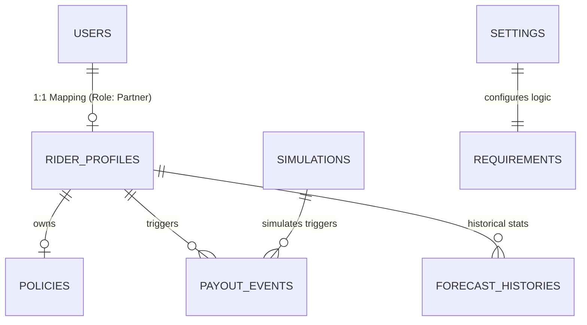

# SkySure Firestore Database Schema

This document provides a comprehensive map of the 10 Firestore collections used in the SkySure project. This serves as the source of truth for all ML training, forensic audits, and backend routing logic.

## 1. Connectivity Map (ERD)

---

## 2. Collection Details & Real-Time Attributes

### A. `rider_profiles` (Master Record)
The primary source of truth for a rider's lifecycle, containing historical aggregates and static metadata.

| Attribute | Type | Description |
| :--- | :--- | :--- |
| `rider_id` | String | Format: `TN_RID_XXXX` (Primary Key) |
| `name` | String | Full name of the gig partner |
| `persona_type`| String | `Full-Timer`, `Part-Timer`, or `Evening-Gigger` |
| `tier` | String | `Pro`, `Standard`, or `Starter` |
| `trust_score` | Number | Real-time reliability metric (0-10) |
| `kyc_status` | String | Identity verification stage (`verified`, `pending`) |
| `weekly_premium`| Number | Premium amount for the selected plan |
| `daily_baseline`| Number | Expected daily earnings for parametric math |
| `ring_score` | Number | Specialized forensic risk index (0-1.0) |
| `risk_reason` | String | Descriptive audit summary (e.g., "Verified: Regular Disruption") |
| `upi_id` | String | Linked payment address |

### B. `payout_events` (Forensic Audit Ledger)
Transaction-level outcomes enriched with ML-derived fraud probabilities.

| Attribute | Type | Description |
| :--- | :--- | :--- |
| `event_id` | String | Unique CID for the settlement |
| `payout_amount` | Number | Disbursed value (Fixed: ₹400 - ₹2,800) |
| `payout_status` | String | `APPROVED`, `BLOCKED`, or `MANUAL_REVIEW` |
| `fraud_status` | String | `CLEAN`, `SUSPICIOUS`, or `FLAGGED` |
| `ml_fraud_prob` | Number | Precision ML confidence score (0-1.0) |
| `trigger_score` | Number | Aggregate climate severity at time of event |
| `weather_at_trigger`| String | Environmental condition (e.g., "Rainy", "Stormy") |

### C. `riders` (Real-Time Telemetry Cache)
A high-velocity collection used by the **Risk Lab** to track ephemeral telemetry during climate pulses.

| Attribute | Type | Description |
| :--- | :--- | :--- |
| `coordinates` | String | Geo-spatial string "lat,long" |
| `session_time_hhmm`| String | Active session timestamp |
| `delivered_orders`| Number | Current pulse order count |
| `fraud_probability`| Number | Real-time heuristic risk (0-1.0) |
| `current_weather`| String | Localized weather state |

### D. `simulations` (Investigation Logs)
Stores the batch results from AI-driven climate simulations.

| Attribute | Type | Description |
| :--- | :--- | :--- |
| `city` | String | Target metro for the pulse |
| `id` | String | Batch ID |
| `riderResults` | Array | Nested JSON of individual forensic outcomes |
| `rainfallMm` | Number | Simulated climate severity |

---

## 3. Configuration & Logic Tables

### E. `requirements`
Stores business rules and forensic logic descriptions.
- **Example**: `Multi-Signal Validation` (Validates IF rainfall > threshold AND order drop > threshold).

### F. `settings`
Global platform constants.
- **Example**: `weatherApiUsage` (Tracks daily API quotas and cache durations).

### G. `policies`
Financial meta-data for active coverage.
- **Attributes**: `policy_start_date`, `policy_end_date`, `total_paid`, `plan_selected`.

---

## 4. Live Production Samples

### Rider Profile Snapshot (`rider_profiles`)
- **ID**: `TN_RID_1000`
- **Data**: `{ name: "Deepak Joshi", city: "Trichy", persona: "Full-Timer", trust_score: 7, ring_score: 0.26, upi: "usr_cff2f634@ybl" }`

### Forensic Audit Event (`payout_events`)
- **ID**: `00e840a9-893c-4bd7-99dc-d00a32a811c1`
- **Data**: `{ payout: ₹448, status: "APPROVED", ml_prob: 0.27, weather: "Rainy", traffic: "High" }`

### Business Logic Rule (`requirements`)
- **ID**: `req_001`
- **Data**: `{ title: "Multi-Signal Validation", priority: "critical", trigger: "rainfall > threshold && orders < baseline" }`

---

> [!IMPORTANT]
> **Data Integrity**: The `payout_events` collection is immutable. Any forensic override by an admin is logged as a status update (`admin_reviewed: true`) rather than a deletion to maintain a clean audit trail for judges.

> [!NOTE]
> All collections use **Firebase Firestore** in Native Mode with secondary indexes optimized for `rider_id` and `payout_status` queries.
